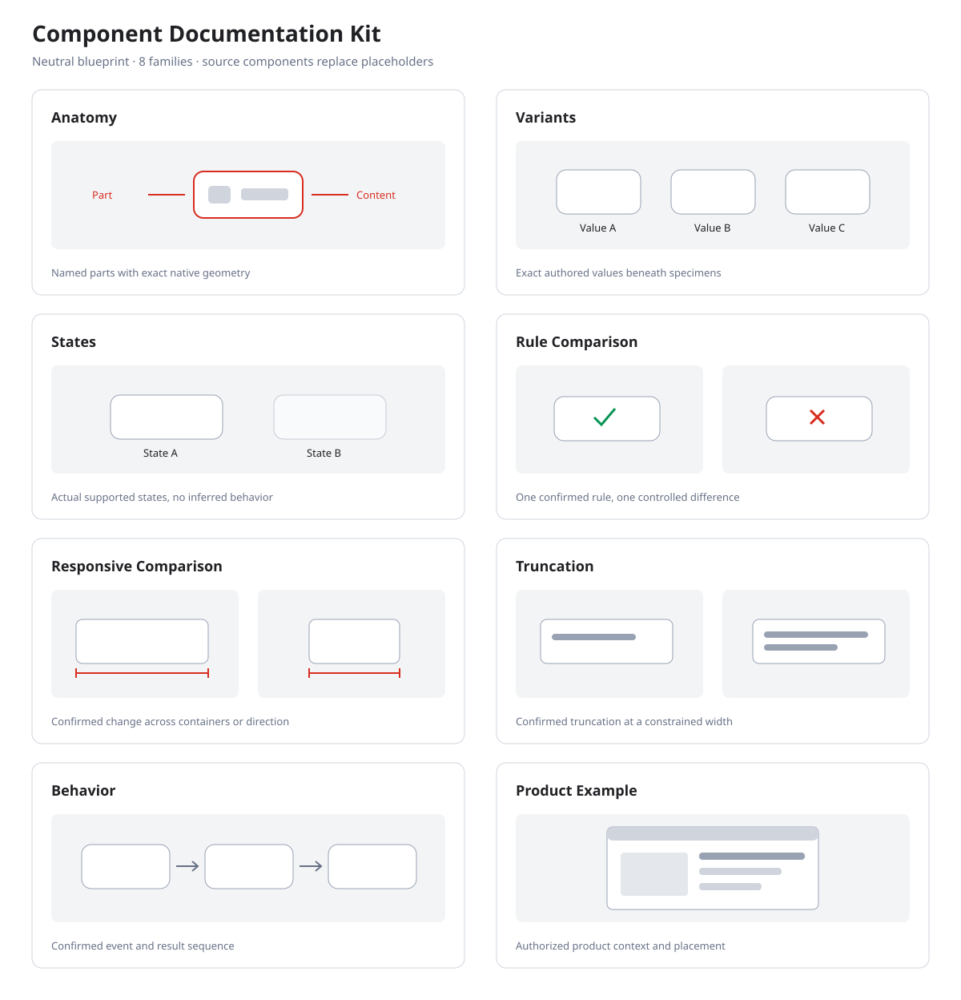
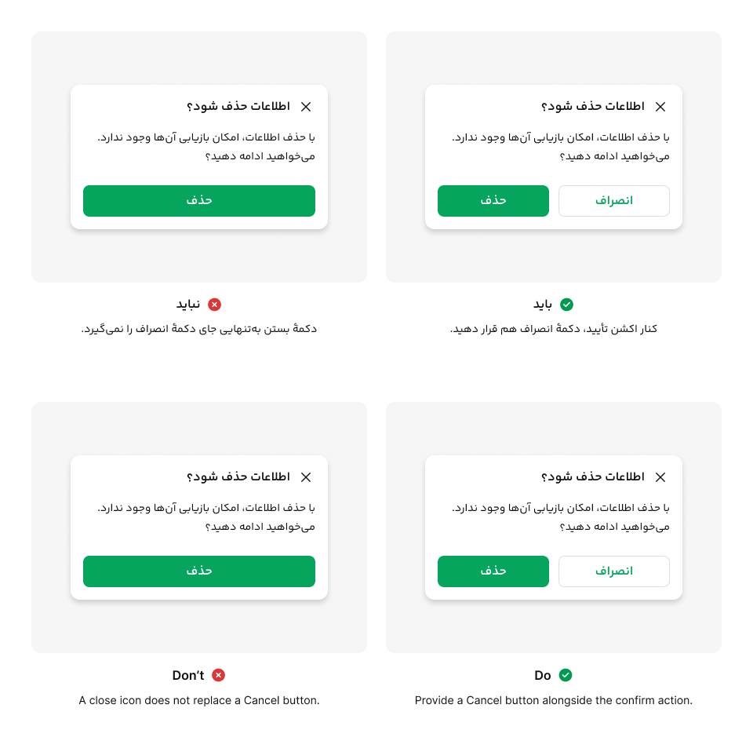

# Design System Documentation

Research, write, illustrate, and assemble design-system component documentation with three Codex skills. Persian-first, with optional English output and editable Figma visuals.



## Real-world example

A Cafe Bazaar dialog guideline, shown with Persian documentation above and English documentation below. The comparison communicates one rule: a close icon does not replace an explicit Cancel action.



The native Persian product UI is preserved in both versions; documentation headings and captions are localized. This is a real documentation example, not a neutral kit template. The image is included for demonstration; Cafe Bazaar product designs are not reusable assets under this repository’s MIT license.

## What is included

| Skill | What it does |
| --- | --- |
| [`component-doc-writer`](component-doc-writer/SKILL.md) | Reads your sources, asks about missing rules, and drafts the sections you choose. |
| [`component-doc-visuals`](component-doc-visuals/SKILL.md) | Builds editable Figma illustrations and checks their geometry and exported images. |
| [`component-doc-assembler`](component-doc-assembler/SKILL.md) | Combines approved text and verified images into a Markdown package. |

Your component sources and confirmed decisions establish the rules. External design systems help identify questions; their policies are never automatically adopted.

Each skill follows numbered steps with explicit inputs, completion checks, and blocked-work handling. A shared claim ledger and figure handoff reduce decisions left implicit during low-reasoning-effort runs. Completed setup is reused; internal checks do not create extra user approval rounds. See the [execution contract](shared/execution-contract.md).

## Requirements

- Codex with local skill support and access to the project files.
- A Figma link to the specific component node, with readable access. Code and authored specifications can supplement that source.
- For visuals: an available Figma connection capable of inspecting and editing nodes and exporting images, an editable destination, and the required `figma-use` skill. Its prerequisites must also be available for the operations you request. Having a Figma browser tab open does not make these tools available to Codex.
- For package checks: Python 3.10 or later. The bundled checker and tests use the standard library. The writer also uses a small Python identifier checker when local execution is available; without it, the writer performs and reports a manual comparison.

Writing requires access to the linked Figma component. Assembly of already approved text and verified images can run without a Figma connection.

## Install

Download or clone this repository, then copy these four folders together into your target project's `.agents/skills/` directory:

```text
.agents/skills/
├── component-doc-writer/
├── component-doc-visuals/
├── component-doc-assembler/
└── shared/
```

Keep `shared` beside all three skill folders: their relative references depend on this layout. If the destination already has a `shared` folder, check for conflicting filenames before merging. Only these four folders are needed at runtime; repository maintenance files are not skill instructions.

Copy [`shared/project.example.json`](shared/project.example.json) to `component-docs.json` in the target project, or let the writer create it during setup. Save real source URLs, identifiers, language preferences, and the output directory there. Keep that configuration outside this public repository.

## Start with a component

Use these input formats. Reuse links already saved in the project; you do not need to paste them on every follow-up.

**Written documentation — required: the component’s Figma node link.**

```text
Use $component-doc-writer to document this component.
Figma component: [link to the component node]
Language: Persian
Sections: [requested sections, or help me choose]
Additional specifications or code, if available: [link or file]
```

**Visual documentation — required: the component’s Figma node link and the paragraph to illustrate. A product example is optional.**

```text
Use $component-doc-visuals to illustrate the following paragraph.
Figma component: [link to the component node]
Paragraph to illustrate: [the exact paragraph]
Product example, if available: [screen link or reference image]
Documentation kit and editable destination: [links, unless already configured]
Language: Persian
```

نمونهٔ پرامپت برای مستند نوشتاری:

```text
با $component-doc-writer مستند این کامپوننت را به فارسی بنویس.
لینک کامپوننت در فیگما: [لینک مستقیم کامپوننت]
بخش‌های موردنیاز: [نام بخش‌ها؛ یا برای انتخاب بخش‌ها راهنمایی کن]
```

نمونهٔ پرامپت برای مستند تصویری:

```text
با $component-doc-visuals برای پاراگراف زیر تصویر مستندات بساز.
لینک کامپوننت در فیگما: [لینک مستقیم کامپوننت]
پاراگراف موردنظر: [متن دقیق پاراگراف]
نمونهٔ محصولی، اگر موجود است: [لینک اسکرین یا تصویر مرجع]
لینک کیت مستندات و محل ساخت تصویر: [اگر قبلاً مشخص نشده است]
زبان تصویر: فارسی
```

The writer inspects the component, settles missing setup, and asks only about relevant unknowns. The visual skill starts from an actual Figma kit template, preserves native component styling, and checks exported images. An omitted optional product example does not block a standalone component illustration. Placement claims still require evidence for the relevant screen or container bounds.

The kit supports Anatomy, Variants, States, Rule Comparison, Responsive Comparison, Truncation, Behavior, and Product Example. [Positioning & Padding in Figma](https://www.figma.com/design/vuz0Ey8cw38miujLZ3kP1d/Component-Documentation-Kit?node-id=85-2) is a dedicated ninth template family, available in FA and EN, for component-to-container spacing. Use its red gap bands only for positioning and padding; use Responsive Comparison for width or behavior changes.

To assemble the final package:

```text
Use $component-doc-assembler to combine the approved drafts and verified
images into the selected Persian and English Markdown documents.
```

If an image is unavailable, the assembler delivers the text and a separate missing-asset note without leaving a broken image link.

## Visual kit

The [kit specification](shared/visual-kit-spec.md) defines editable documentation templates at 960 logical px wide, with FA and EN layouts. It controls annotations and framing, while product components retain their native appearance.

An [editable Figma kit](https://www.figma.com/design/vuz0Ey8cw38miujLZ3kP1d/Component-Documentation-Kit?node-id=3-2) is available subject to the file's sharing permissions. Set `visualKit.pageUrl` to your project's copy. The visual skill must instantiate the actual kit template before composing a figure. If the kit is inaccessible, provide an accessible copy or link; it will not silently recreate the template. Creating a new kit is a separate, explicitly requested setup task. Font files are not bundled.

## Output

- Selected sections as Markdown, in Persian, English, or separate files for both.
- A separate evidence and decisions note.
- When requested and verified: image exports, an editable Figma reference, and a visual handoff with configuration and verification details.

Visual-only delivery uses one section per component containing image embeds. Full documentation places figures alongside their corresponding text.

## Validation status

Local evaluations cover skill selection, a four-turn interview, bilingual writing, missing-source handling, and Markdown assembly. Explicit low-effort runs on GPT-6 Astra, Sol, and Luna exposed identifier errors, leading to more precise instructions and a Python identifier checker. Sol passed three writing runs after the first fix; Astra passed two writing regression runs. Luna passed only one of its final two writing runs on the same instructions, so reliable low-effort writing with Luna is not established. These are small synthetic tests across successive revisions, not a model benchmark.

All 21 portable tests passed. The identifier checker validates the supplied inventory; it cannot detect source facts omitted from that inventory. Live low-effort Luna and Sol runs also produced Anatomy, Variants, and Responsive figures. Independent image and geometry review found callout defects in both models and black dimension labels in Luna’s responsive output. Those findings informed the current rules; these latest instruction changes have not yet been rerun live. See the detailed evaluation scope below.

See [testing and limitations](docs/testing.md) for scope and commands. Package checks are not proof of visual correctness or publication rights.

## Contributing and license

See [CONTRIBUTING.md](CONTRIBUTING.md) for maintenance and release checks. Instructions and neutral kit assets are distributed under the [MIT license](LICENSE). The Cafe Bazaar example image is excluded from that license. Linked Figma files, fonts, and user-supplied product assets require their own permission review.
